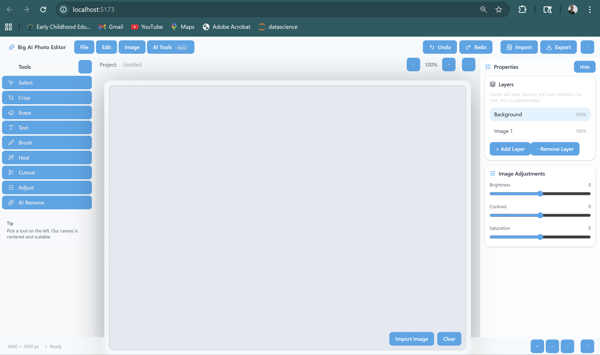

<!-- _class: invert -->

# AI-Image-Editor

### Aaliyah Creech, Nickson Ibrahim, Gabriel Mingle, Gloria Uwimbabazi 

---
# Project OverView
- A web-based image editing application

- Allows users to import, edit, and enhance images interactively

- Designed to integrate traditional image editing tools (Brush, Crop, Text, Erase, Etc) with AI-powered features (Deblur, Inpainting, Outpaint, Background Removal).

---

# Framework: Front-End
## Front-End Architecture
- Built as a Single Page Application (SPA)

- Component-based architecture using React

- Canvas-based rendering for image manipulation using Fabric.js

- Tool logic separated from UI logic for scalability and maintainability

---
# Front-End Technology Stack
## Technologies & Libraries Used
- **React (Vite)** – UI framework and fast development environment

- **Fabric.js** – Canvas abstraction for image and object manipulation

- **Tailwind CSS** – Responsive and consistent UI styling

- **Lucide-React** – Icon library for professional UI icons

---

# Framework: Back-End

Content

---

# AI Functions

- Deblur

- Inpainting

- OutPainting

- Background Removal

---

# Interface Design
## Main UI Layout

- **Top Menu Bar** – File, Edit, Image, AI Tools

- **Left Toolbox** – Editing tools (Select, Erase, Text, Brush, etc.)

- **Center Canvas Area** – Main editing workspace

- **Right Properties Panel** – Layers and adjustment controls

- **Footer** – Status and future timeline controls

---

---

# ToolBox Design and Interaction
## Left Toolbox (Tool Selection)

- Displays all available non AI editing tools (Select, Crop, Erase, TeXt, Brush, Heal, Cutout, and Adjust)

- Only one tool can be active at a time

- Clicking a tool updates a global activeTool state

- Visual highlight shows the currently active tool

---

# Canvas Area Design
## Canvas Workplace
- Centered, responsive canvas container

- Automatically resizes using ResizeObserver

- Fabric canvas mounted once and reused

- Supports image import, object selection, and drawing

---
# Properties Panel Design
## Right Side Properties Panel
- Displays Layers (Background, Image)

- Placeholder controls for:
   - Brightness
   - Contrast
   - Saturation

- Designed to update dynamically based on selected object

--- 

---

# Supported Editing Functions

<!-- ai-enabled or otherwise -->

---

# Implementation Status 
- we designed UI

- We implemented some of the tools in the Toolbox:
  - Select Tool: Move, resize, and select objects
  - Erase Tool: Draws mask paths using Fabric’s brush system
  - Text Tool: Click to place editable text objects
  - Brush Tool: Free-drawing with adjustable color and size

-  
---
# Tool Enabling Design Pattern
- User clicks a tool in the Toolbox
- activeTool state is updated in App.jsx
- CanvasArea passes activeTool to useCanvas
- useCanvas calls setToolMode(canvas, activeTool)
- canvasUtils.js activates the correct tool logic

---
# Implementation Plan

---

<!-- Ideally the remaining plan is itemized per team member -->