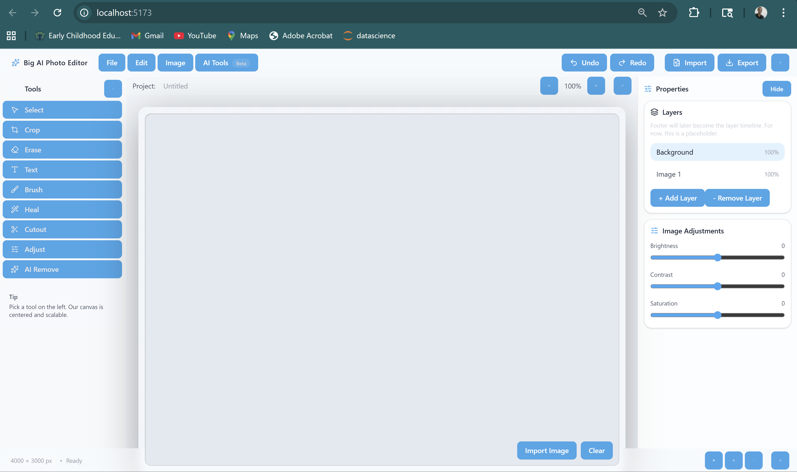

<!-- _class: invert -->

# AI-Image-Editor

### Aaliyah Creech, Nickson Ibrahim, Gabriel Mingle, Gloria Uwimbabazi 

---

# Framework: Front-End

Example Content

---

# Framework: Back-End

Content

---

# AI Functions

- Deblur
- Inpainting
- OutPainting

---

# Interface Design
## Main UI Layout

- **Top Menu Bar** – File, Edit, Image, AI Tools

- **Left Toolbox** – Editing tools (Select, Erase, Text, Brush, etc.)

- **Center Canvas Area** – Main editing workspace

- **Right Properties Panel** – Layers and adjustment controls

- **Footer** – Status and future timeline controls

---

---

# ToolBox Design and Interaction
## Left Toolbox (Tool Selection)

- Displays all available non AI editing tools (Select, Crop, Erase, TeXt, Brush, Heal, Cutout, and Adjust)

- Only one tool can be active at a time

- Clicking a tool updates a global activeTool state

- Visual highlight shows the currently active tool

---

# Canvas Area Design
## Canvas Workplace
- Centered, responsive canvas container

- Automatically resizes using ResizeObserver

- Fabric canvas mounted once and reused

- Supports image import, object selection, and drawing

---
# Properties Panel Design
## Right Side Properties Panel
- Displays Layers (Background, Image)

- Placeholder controls for:
   - Brightness
   - Contrast
   - Saturation

- Designed to update dynamically based on selected object

--- 

# Implementation Status 
- We designed UI (Gloria and Aaliyah)

- We implemented some of the tools in the Toolbox: (Gloria and Nickson)
  - Select Tool: Move, resize, and select objects
  - Erase Tool: Draws mask paths using Fabric’s brush system
  - Text Tool: Click to place editable text objects
  - Brush Tool: Free-drawing with adjustable color and size

- Implemented API to run AI functions (Gabe)
  - Inpainting and Describe

---

# Editing Functions to be Supported by System

<!-- ai-enabled or otherwise -->
- Planning on implementing:
  - Crop function
  - Deblurring
  - Inpainting/Outpainting
  - Background removal
  - Image Adjustments

---
# Tool Enabling Design Pattern
- User clicks a tool in the Toolbox
- activeTool state is updated in App.jsx
- CanvasArea passes activeTool to useCanvas
- useCanvas calls setToolMode(canvas, activeTool)
- canvasUtils.js activates the correct tool logic

---
# Implementation Plan
- Integrate the AI API endpoints as functions in the frontend
- Backend optimization to prevent errors
- Finalize UI design to ensure all AI/non-AI tools are working
- Testing/Validation

---

<!-- Ideally the remaining plan is itemized per team member -->