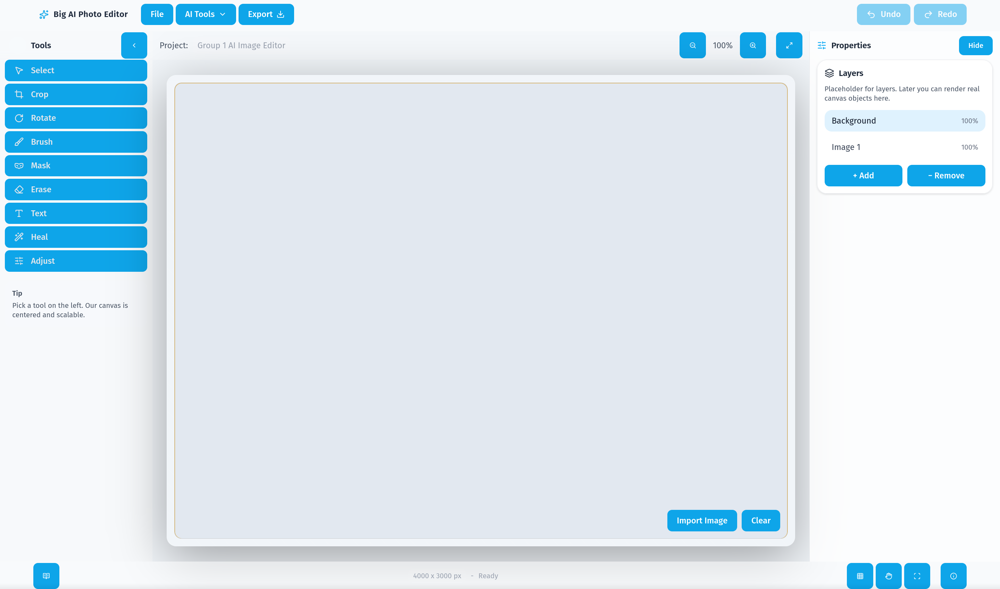

[~ Home](../README.md) | [Next (Procedural Instructions) ->](procedure.md)

# Feature Guide

This guide explains the major features available in the AI Image Editor. It is intended to help users understand what each tool does, where to find it, and when to use it.

## Workspace Overview

The editor is organized into four main areas:

- The top menu bar contains project-wide actions such as opening files, choosing AI tools, exporting, undo, and redo.
- The left toolbox contains manual editing tools for drawing, masking, cropping, rotating, healing, and text placement.
- The center canvas is the live editing area where images and edits are displayed.
- The right properties panel changes based on the active tool and exposes settings for that tool.

## File and Project Actions

### Open Image

Users can import an image either from the `File` button in the top menu bar or the `Import Image` button near the canvas.

- Supported input is an image selected from the local machine.
- The image is centered in the canvas after import.
- Re-importing another image replaces the current working image.

### Export

The `Export` button downloads the current canvas as a PNG image.

- Export includes the visible canvas result.
- This is useful after manual edits or after applying an AI-generated result.

### Undo and Redo

Undo and redo allow users to move backward and forward through recent edits.

- Undo reverses the most recent change.
- Redo restores the last undone change.
- These actions are especially useful while trying several edits before choosing a final result.

## Manual Editing Tools

### Select Tool

The `Select` tool is used to choose and move editable objects on the canvas.

- Use it to reposition imported images or text.
- It is also the safest tool to return to after finishing another action.

### Crop Tool

The `Crop` tool trims the current image to a selected area.

- Activate `Crop` from the toolbox.
- Adjust the crop region on the canvas.
- Click `Apply Crop` to commit the crop.
- Use this tool when extra borders or unwanted framing should be removed.

### Rotate Tool

The `Rotate` tool changes the orientation of the current image.

- Rotate left or right using the rotate controls.
- Reset rotation if the image should return to its original angle.
- This is useful when a photo was imported sideways or needs quick straightening.

### Brush Tool

The `Brush` tool draws directly onto the canvas.

- Brush color can be selected with the color picker.
- Brush size can be adjusted with the size slider.
- This tool is useful for annotation, sketching, or rough visual markup.

### Mask Tool

The `Mask` tool marks regions that will be used by the inpainting feature.

- Draw over the area that should be regenerated.
- The mask is used as an instruction layer for AI inpainting.
- This tool is typically used before choosing `AI Tools > Inpaint`.

### Erase Tool

The `Erase` tool removes brush or mask strokes.

- Use it to clean up brush marks.
- Use it to refine a mask before sending it to the AI model.
- This is helpful for making inpainting boundaries more precise.

### Text Tool

The `Text` tool adds editable text objects to the canvas.

- Click on the canvas to place a new text object.
- Text can then be moved and edited.
- This is useful for labels, captions, or simple poster mockups.

### Heal Tool

The `Heal` tool performs a clone-style repair for small imperfections.

- Set a source point with `Alt` on Windows/Linux or `Option` on macOS.
- Paint over the target area to copy nearby image content.
- Flow and brush size can be adjusted to make the repair softer or stronger.

This tool is useful for removing dust spots, small blemishes, or repeated texture issues without running a full AI operation.

### Adjust Tool

The `Adjust` tool changes the appearance of the current image using image filters.

- Brightness changes the lightness of the image.
- Contrast changes the difference between dark and light areas.
- Saturation changes color intensity.

This is useful for quick corrections before export or before sending an image into an AI feature.

## AI Features

The editor includes a group of AI-powered tools available from the `AI Tools` menu and configured through the properties panel.

### Inpaint

`Inpaint` replaces a masked area with new generated content.

- Requires an image and a mask.
- Accepts an optional prompt describing what should appear in the masked region.
- Also exposes guidance scale, step count, and seed controls.

Use this feature to remove objects, replace damaged areas, or generate new content inside part of an image.

### Outpaint

`Outpaint` expands the image beyond its current edges.

- Requires an image.
- Users select one or more directions to expand: top, bottom, left, or right.
- An optional prompt can describe how the new surrounding area should look.

Use this feature to widen a photo, extend a background, or create more room for design layouts.

### Deblur

`Deblur` attempts to improve an image that appears soft or slightly blurred.

- Requires an image.
- An optional prompt can be provided.
- The output is applied back to the canvas when processing finishes.

Use this feature for photos that need a quick clarity improvement before further editing.

### Background Magic

`Background Magic` groups two background-related actions:

- `Remove Background` removes the image background and keeps the subject.
- `Remove & Replace Background` removes the current background and generates a new one based on a prompt.

This feature is useful for product images, portraits, or quick concept mockups with alternate scenes.

## Canvas Controls

The canvas includes navigation controls to make editing easier.

- Zoom in enlarges the canvas view.
- Zoom out reduces the canvas view.
- Fit-to-view scales the image back into the available workspace.
- Clear resets the current canvas contents.

These controls are especially helpful when working on small details such as masks, healing, or brush edits.

## Built-In Documentation Viewer

The project also includes a documentation viewer served by the backend.

- Markdown files in the `docs/` directory are rendered in the browser.
- Navigation links at the top of each page connect the manual sections.
- Images in the `docs/assets/` folder are displayed inline to support the written explanations.