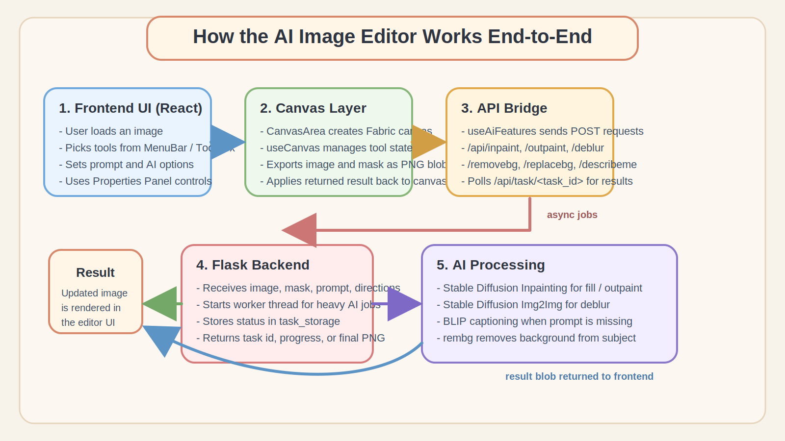

<!-- _class: invert -->

# AI-Image-Editor

### Aaliyah Creech, Nickson Ibrahim, Gabriel Mingle, Gloria Uwimbabazi 

---
## Introduction
- **Project:** An AI Powered Web-Based Graphics Application
- **Frameworks:**
  - [x] Frontend - React.js
  - [x] Backend - Python
- **Features:**
    - AI-Powered Featue: Inpainting, Background Removal, Deblurrring & Background Replacement
    - Non-AI-Powered Featue: Image Uploading, Downloading, Editing, Undo, redo, Export & More
- **Models:**
  - `runwayml/stable-diffusion-inpainting`
  - `runwayml/stable-diffusion-v1-5`
---
## Architecture


---
## FrontEnd
- Built as a React.js single-page application with a component-based layout
- We use **Fabric.js** to create and manage the editable canvas, so images, text, brush strokes, and masks can be handled as objects
- Tool behavior is controlled by React state through `activeTool`, then passed into `useCanvas()` and `canvasUtils.js` to activate the correct mode
- The `ToolBox` is used to switch between editing tools such as Select, Crop, Brush, Mask, Erase, Text, Heal, and Adjust
- The `PropertiesPanel` provides controls for brush size, color, heal flow, image adjustments, and AI settings like prompt, guidance scale, steps, and seed
- For AI features, React exports the current canvas image and mask as **Blob** objects, then sends them to the Flask API
- When the backend returns the processed result, the frontend applies that blob back onto the Fabric canvas as the updated image layer

---


---
## Undo / Redo Algorithm

```text
Algorithm: performAction(argumentType)

Begin
    Snapshot <- Canvas.currentState
    HistoryStack.push(Snapshot)
    SnapshotCount <- SnapshotCount + 1

    Apply Action(argumentType) -> Canvas
    CanvasRender <- CanvasRender + 1

    If ActionSuccess = true Then
        ResultState <- Canvas.updatedState
        RedoStack <- empty
        UndoPointer <- UndoPointer + 1
        Return ResultState
    Else
        Return ErrorState
    End If
End
```

---
## BackEnd
<!-- Models Used -->
<!-- Functionality -->
<!-- Technologies Used -->

---
## Demo (Live)


---
## Challenges
<!-- Resource Usage -->
<!-- Model Flaws -->
- Due to resource constraints, we were limited to using free and open-source AI models
- Limited server space and compute made it difficult to host and run multiple models at the same time
- Because of these restrictions, users cannot yet choose from several model options for the same feature
- Time constraints also prevented us from implementing all of the AI features we originally planned

---
## Future Work
<!-- Better Model Selection / Creation -->
- Explore stronger and more specialized models to improve output quality
- Expand server capacity so multiple models can be deployed and offered as user-selectable options
- Add more AI features that were part of the original vision but could not be completed in this phase
- Continue optimizing model performance, speed, and reliability for real-time editing workflows


---
## 


---

