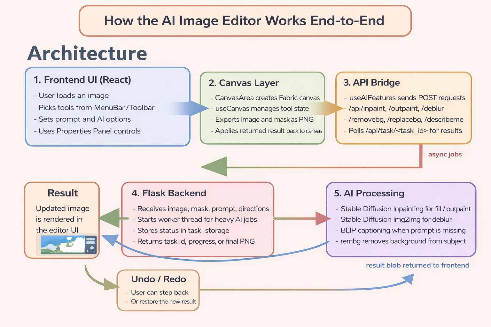
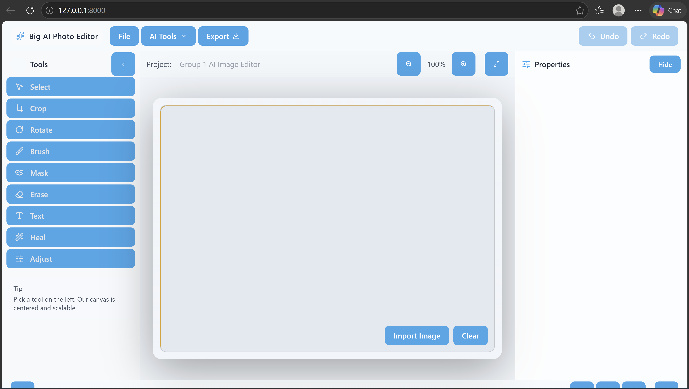
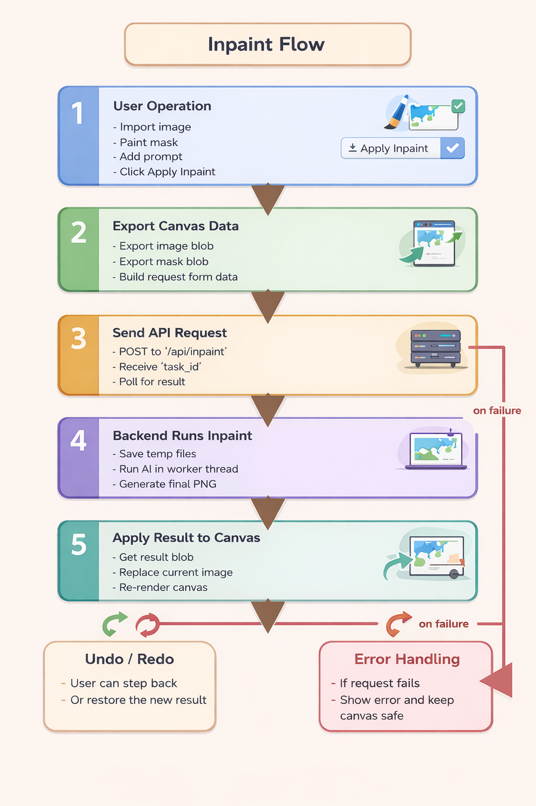

<!-- _class: invert -->

# AI-Image-Editor

### Aaliyah Creech, Nickson Ibrahim, Gabriel Mingle, Gloria Uwimbabazi 

---
# Presentation Content
1. Project Overview
2. Framework and Architecture
    - Frontend
    - Backend
4. Demo
5. Challenges
6. Future Work
---
# Project Overview
- A web-based image editing application

- Allows users to import, edit, and enhance images interactively

- Designed to integrate traditional image editing tools (Brush, Crop, Text, Erase, Rotate, Etc) with AI-powered features (Deblur, Inpainting, Background Removal, Background Replacement).

---
# Framework And Editing Functions
## Framework
  - [x] Frontend - React.js
  - [x] Backend - Python
## Editing Functions
    - AI-Based Editing Features: Inpainting, Background Removal, Background Replacement and Deblur
    - Basic Editing Functions: Select, crop, rotate, text, heal, brush, erase and adjust,etc

---

---
## FrontEnd
- Built as a React.js single-page application with a component-based layout
- We use **Fabric.js** to create and manage the editable canvas, so images, text, brush strokes, and masks can be handled as objects
- Tool behavior is controlled by React state through `activeTool`, then passed into `useCanvas()` and `canvasUtils.js` to activate the correct mode
- The `ToolBox` is used to switch between editing tools such as Select, Crop, Brush, Mask, Erase, Text, Heal, and Adjust

---
## FrontEnd (Cont.)
- The `PropertiesPanel` provides controls for brush size, color, heal flow, image adjustments, and AI settings like prompt, guidance scale, steps, and seed
- For AI features, React exports the current canvas image and mask as **Blob** objects, then sends them to the Flask API
- When the backend returns the processed result, the frontend applies that blob back onto the Fabric canvas as the updated image layer

---
## Undo/Redo Implementation
### How We Implemented Undo & Redo
- Built inside useCanvas (React hook)
- Used two stacks:
  - undoStackRef: stores previously committed canvas states. 
  - redoStackRef: stores states that have been undone and can be restored.
- Each state saved as canvas.toJSON() (Fabric.js snapshot)
- Restored using canvas.loadFromJSON()

---
## Saving State
### Saving Canvas State
- Triggered after user actions:
  - Non-AI edits and AI edits
- Avoid duplicates
- Clear redo stack on new action
### Procedure SaveState(state):
    if undoStack is empty OR top ≠ state:
        push state to undoStack
        clear redoStack
---
## Undo Logic
### Undo Operation
- Move current state → redo stack
- Restore previous state
### Procedure Undo():
    if undoStack has more than 1 state:
        current ← pop undoStack
        push current to redoStack
        previous ← top undoStack
        restore previous
---
## Redo Logic
### Redo Operation
- Move state back → undo stack
- Restore it
### Procedure Redo():
    if redoStack is not empty:
        next ← pop redoStack
        push next to undoStack
        restore next
---

---
 # BackEnd
## Technologies Used
  - Flask API to connect the React frontend with local AI services
  - PyTorch + Hugging Face Diffusers/Transformers for model inference
  - PIL/Pillow for image resizing, mask blending, and PNG processing
  - `rembg` for background removal before replacement workflows

---
## Models Used
  - `runwayml/stable-diffusion-inpainting` for inpainting and outpainting
  - `runwayml/stable-diffusion-v1-5` for deblurring with img2img generation
  - `Salesforce/blip-image-captioning-base` for image description and prompt generation

---
## Functionality
  - API endpoints support inpaint, outpaint, deblur, describe, remove background, and replace background
  - Longer AI jobs run asynchronously in background threads and return a `task_id`
  - The frontend polls `/api/task/<task_id>` to receive progress updates and the final PNG result
  - Temporary files are created for uploads/results, then cleaned up to reduce server memory usage
  - The backend automatically uses `CUDA`, `MPS`, or `CPU` depending on the machine

---

---
## Deblur

1. The user imports an image they wish was less blurred.
2. The app exports the image and an optional prompt and sends it to the API
3. The API determines if it has received a prompt, and generates one if it hasn't.
4. Then it runs the Deblur Pipe which built on `runwayml/stable-diffusion-v1-5`
5. It will then return the resulting image.

---

## Demo (Live)
https://aiedit.ozpyn.dev

---
## Challenges
<!-- Resource Usage -->
<!-- Model Flaws -->
- Due to resource constraints, we were limited to using free and open-source AI models
- Limited server space and computer made it difficult to host and run multiple models at the same time
- Because of these restrictions, users cannot yet choose from several model options for the same feature
- Time constraints also prevented us from implementing all of the AI features we originally planned

---
## Future Work
<!-- Better Model Selection / Creation -->
- Explore stronger and more specialized models to improve output quality
- Expand server capacity so multiple models can be deployed and offered as user-selectable options
- Add more AI features that were part of the original vision but could not be completed in this phase
- Continue optimizing model performance, speed, and reliability for real-time editing workflows

---
## Appreciation (Thank you for listening!)
- We want to thank our professor, Prof. Ye, for his guidance and support throughout
- We also want to thank our classmates for their feedback and encouragement during the pairwise meetings and presentations

---
