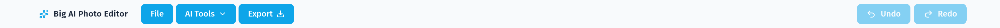
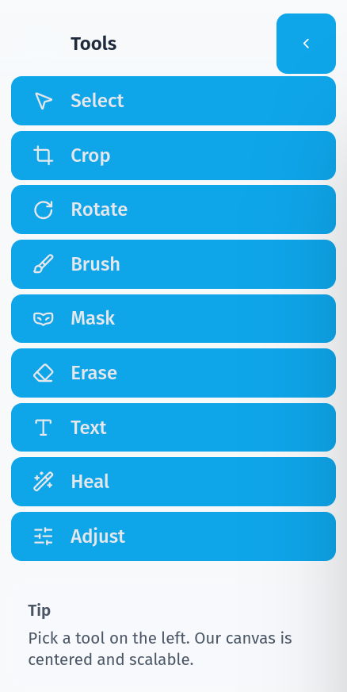
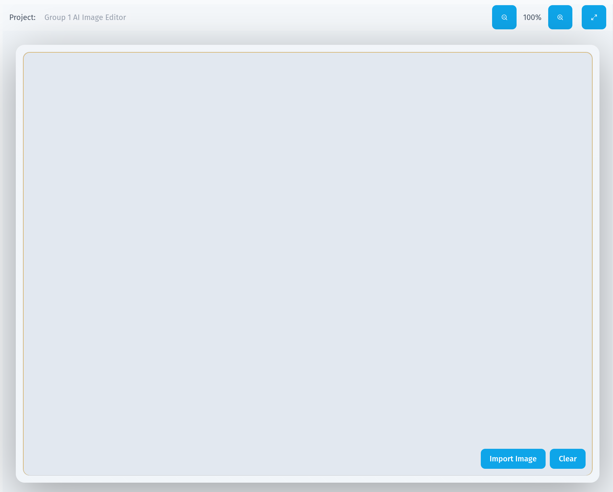
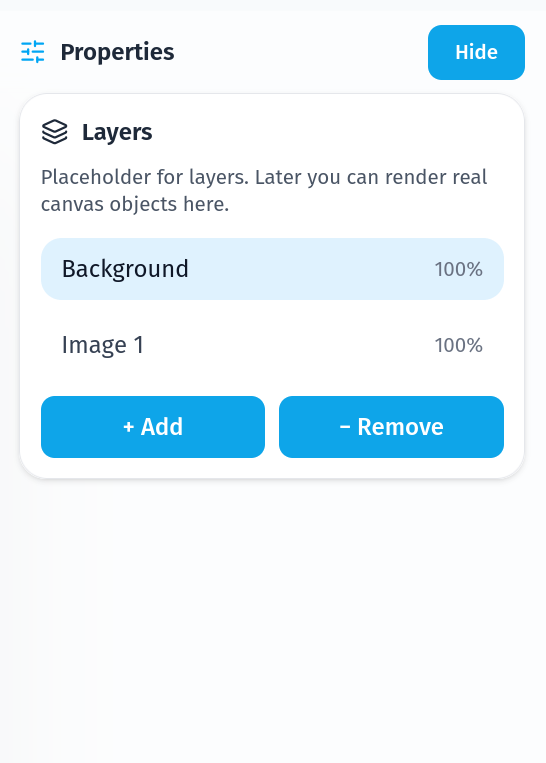

[~ Home](../README.md) | [Next (Feature Guide) ->](feature-guide.md)

# Interface Overview

The application is arranged as a simple editing workspace. The top of the screen contains the main menu, the left side contains the tool list, the center contains the canvas where the image is edited, and the right side contains properties for the currently active tool.

### Top Menu Bar

The top menu bar is used for the most common project-wide actions:

- `File` opens an image from the local machine
- `AI Tools` selects one of the available AI powered tools
- `Export` downloads the current canvas as a PNG image
- `Undo` reverses the previous action when available
- `Redo` restores an undone action when available

The menu bar is intended to stay visible while editing so these actions are always accessible.

### Left Toolbox

The left toolbox contains the standard editing tools used for manual image editing. Only one tool can be active at a time.

The currently implemented tools include:

- `Select` for choosing and moving editable objects
- `Crop` for trimming the active image
- `Rotate` for rotating the active image
- `Brush` for free drawing
- `Mask` for marking areas to be used by inpainting
- `Erase` for removing brush or mask content
- `Text` for placing editable text
- `Heal` for clone style touch-up edits
- `Adjust` for brightness, contrast, and saturation changes

Some tools display additional options directly inside the toolbox, such as brush size, brush color, or rotate controls.

### Center Canvas Area

The center of the interface contains the main Fabric canvas. This is the primary workspace where imported images, drawn marks, text objects, masks, and AI results are displayed.

The canvas area also includes:

- Zoom in and zoom out controls
- A fit-to-view control
- A project label
- A loading state while the canvas is initializing

When an image is loaded, it is centered and scaled to fit the available workspace.

### Right Properties Panel

The right properties panel changes based on the active tool. It is used to control tool-specific values without cluttering the main workspace.

Examples of settings shown in this panel include:

- Brush color and brush size
- Heal tool flow and stamp size
- Brightness, contrast, and saturation values
- AI prompt, guidance scale, step count, and seed
- Outpaint direction selection

This panel is mainly visible on larger screen sizes, where there is enough room for the expanded workspace layout.

### Documentation View

In addition to the editor itself, the project also provides a built-in documentation viewer through the Flask server. Markdown files in the `docs/` directory are rendered in the browser and linked together using the navigation links at the top of each page.
